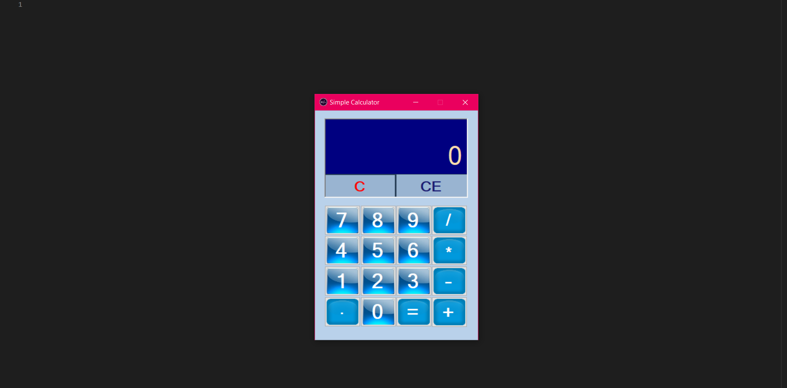

## About this application.
This is a Simple Calculator App. built using windows form and applying OOP concepts in C#.

# Get Started with this app.
Clone this repo and run the solution file, Preferably using visual studio 2019. Simply by clicking the solution file in the package named ('SimpleCalculator.sln').

